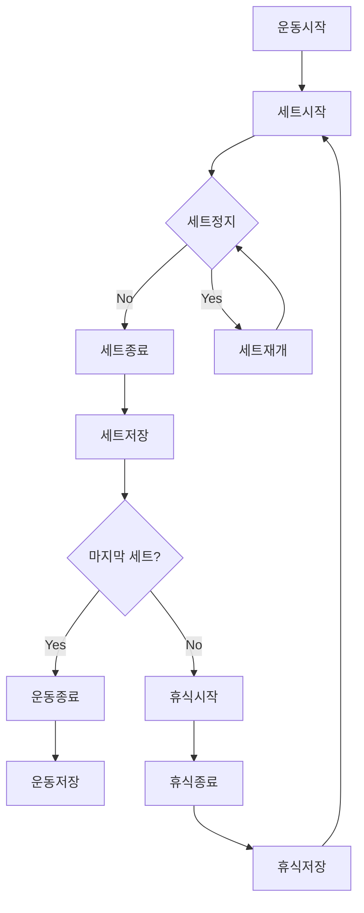

```mermaid
graph TD
	%% ====== 노드 ======
	%% 운동
	exSt[운동시작]
	exFi[운동종료]
	exSv[운동저장]
	
	%% 운동 조건
	exLast{마지막 세트?}
		
	%% 세트
	setSt[세트시작]
	setFi[세트종료]
	setSv[세트저장]
	setRe[세트재개]
	
	%% 세트 조건
	setStop{세트정지}
	
	%% 휴식
	restSt[휴식시작]
	restFi[휴식종료]
	restSv[휴식저장]
	
	exSt --> setSt
	setSt --> setStop
	setStop -- Yes --> setRe --> setStop
	setStop -- No --> setFi --> setSv
	setSv --> exLast
	exLast -- Yes --> exFi --> exSv
	exLast -- No --> restSt --> restFi --> restSv --> setSt
```
