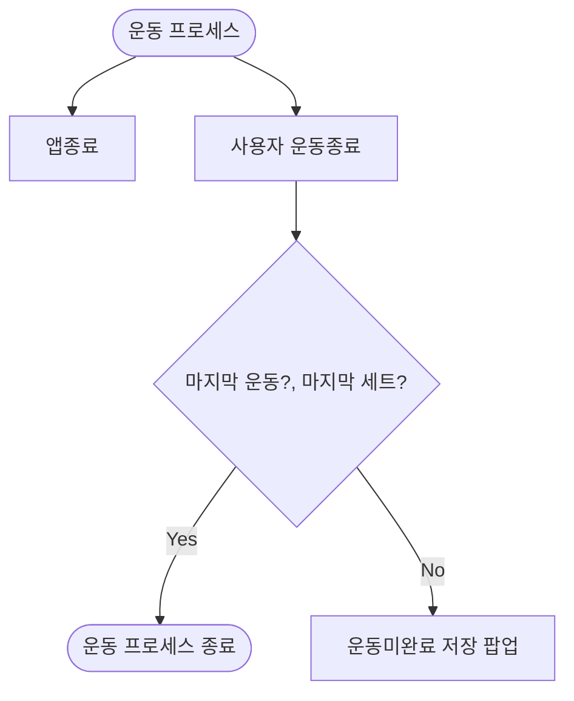

```mermaid
graph TD
	%% ===== 노드 =====
	appFi[앱종료]
	appAlert1[운동미완료 저장 팝업]
	
	%% 운동
	exProcess([운동 프로세스])
	exProcessFi([운동 프로세스 종료])
	exFi[사용자 운동종료]
	
	%% 운동 조건
	exLast{마지막 운동?, 마지막 세트?}
	
	exProcess --> exFi
	exFi --> exLast
	exLast -- Yes --> exProcessFi
	exLast -- No --> appAlert1

	
	exProcess --> appFi
```

- 운동 저장 시 항목
	- 시작시간, 순 운동시간, 종료시간, 종목 {[세트 {운동시간, 휴식시간, 세트넘버, 무게, 개수, 평균 심박수, 워밍업 여부}]}